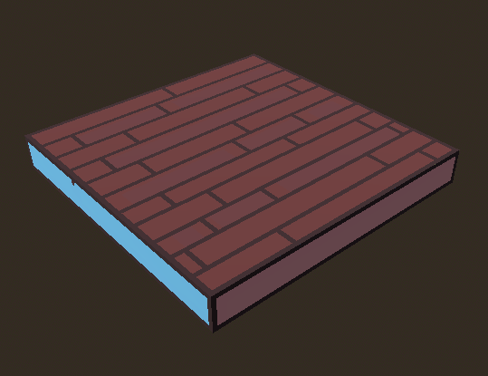
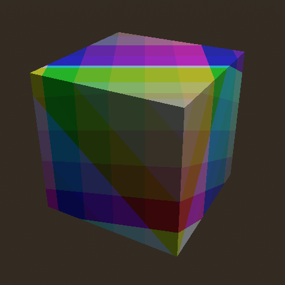
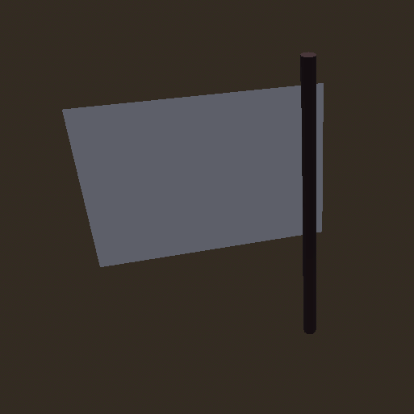
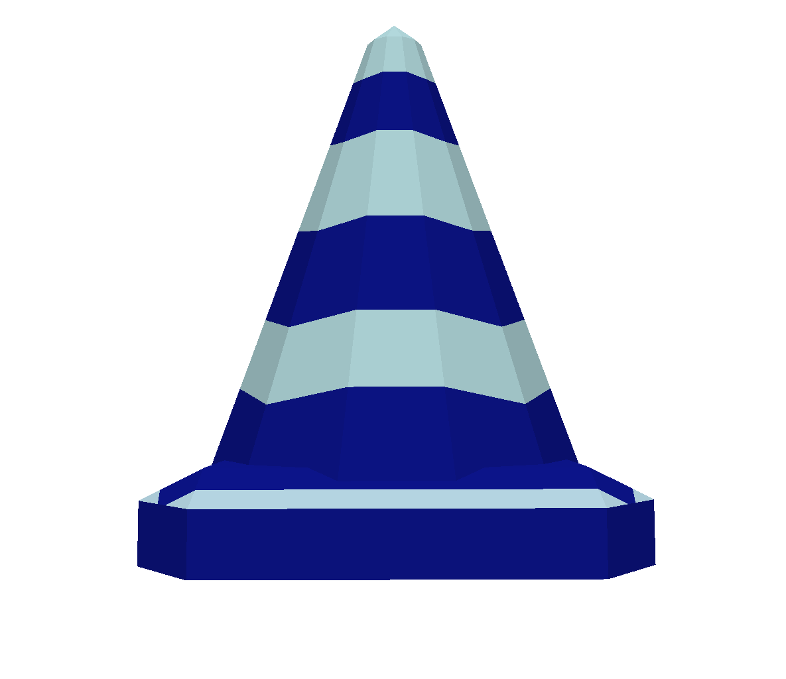
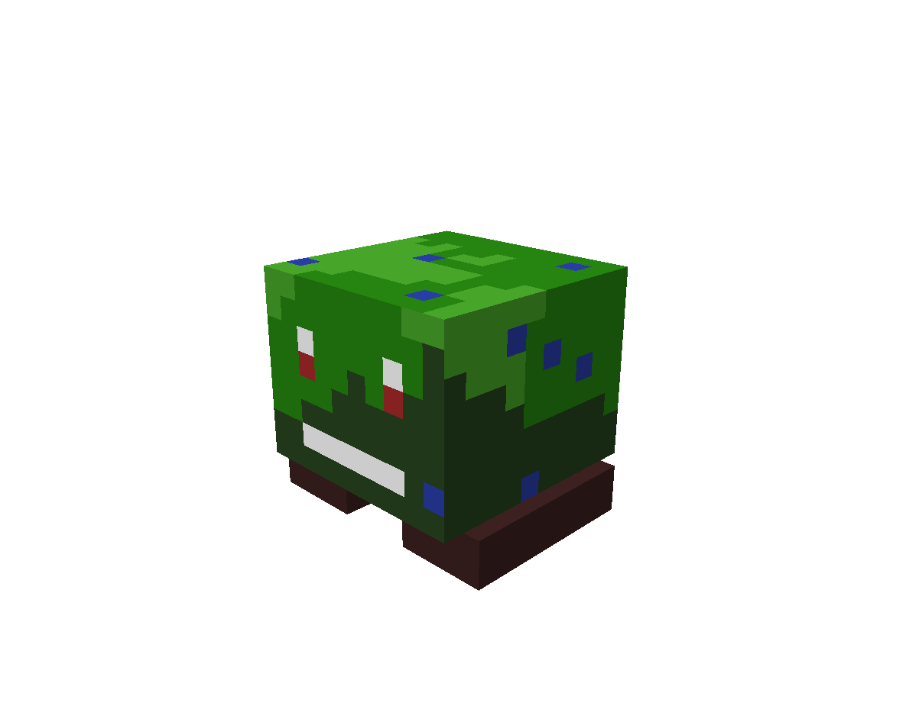

# Running
## how to use

- launch multiple instances
- make one the host, then the other instances are clients
- on the host, set the watch path to the current directory
- the host should select a scene to send to the clients (testscene.tscn is a good one)
- after all clients are loaded into the scene, the host can use the buttons in the bottom right to unlock player movement 
	- either instantly, or after a countdown

# Prefabs

### Small Platform

### Cube

### Ice Cube

### Nuclear Cube

### Octagon

### Tree

### Rock

### Checkpoint
Set spawn point

### Blue Cones
Collect all blue cones in level to trigger event

### Frog
Enemy chases player

### Black Hole
Friendly black hole, kills the player

### Damage Field
Damages the player

### Push Button
Press E to push to trigger event

### Player/Server events
Cause things to happen to player AND/OR trigger other events when certain events happen

### Activation Range
Only activate an object when the player gets near

# todo

- [X] simple enemy that follows the player, force player to respawn
	- [ ] mole enemy
	- [ ] angry sun
- [X] player HP
- [X] sounds
- [X] player death animation
- [X] timer
- [X] checkpoints
- [ ] powerups
- [ ] more prefabs
	- [ ] static obstacles of various shapes
		- [X] trees
		- [X] rocks
		- [X] cubes
		- [X] nuclear cube
	- [ ] interactables
		- [X] button
		- [X] red coins
		- [X] signal relays (source engine style)
- [ ] example scenes
	- [X] gravity area
	- [ ] CSG cave using path3d
	- [X] moving platform
- [ ] server switch cameras
	- [X] level cameras
	- [ ] player first person camera
	- [X] player freecam
- [X] countdown
	- [X] player unlock button
- [ ] client disconnect logic
- [ ] noclip
- [ ] dedicated server + rooms

## bugs
- [] testscene2 the platform hitbox is not synced with visuals
